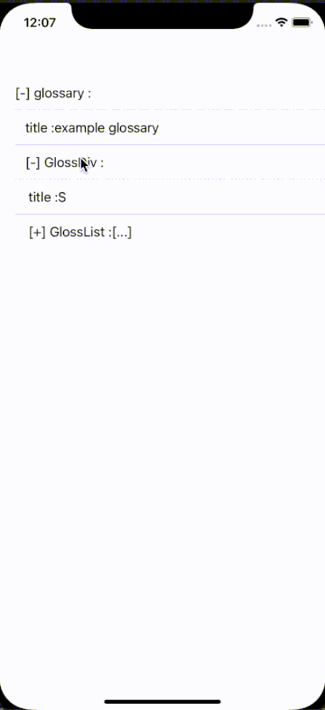

# ZGExpandableTable



ZGExpandableTable is an iOS component designed to facilitate viewing JSON files on mobile devices. JSON files are often lengthy and hierarchical, making them challenging to view and navigate on a small screen. This component provides an expandable table view that allows users to view JSON content in a convenient, layer-by-layer manner.

## Features

- Recursively expand JSON hierarchies in a UITableView.
- Easy integration with minimal setup.
- Example project included to demonstrate functionality.

## Example

To see ZGExpandableTable in action, check out the example project included in this repository. It uses a sample JSON from [json.org](https://json.org/example.html) to demonstrate content loading and display.

### Example Code

Here's how you can set up and use ZGExpandableTable in your project:

```objc
NSString *examplePath = [[NSBundle mainBundle] pathForResource:@"example" ofType:@"json"];
NSData *exampleJSON = [NSData dataWithContentsOfFile:examplePath];

ZGExpandableTableController *tableController = [[ZGExpandableTableController alloc] initWithTableViewFrame:self.view.bounds style:UITableViewStylePlain];
UITableView *tableView = tableController.tableView;
[self.view addSubview:tableView];

[tableController loadJSON:exampleJSON];
```

## Installation

ZGExpandableTable has been made into a pod. To use it, please add the following to your Podfile:

```ruby
pod 'ZGExpandableTable', :git => 'https://github.com/ziggear/ZGExpandableTable.git'
```

Then run:

```sh
pod install
```

## Project Design

### Data Parsing
ZGExpandableTable uses a recursive approach to create `ZGJSONNode` objects because JSON is inherently recursive. Each node has an "expanded" property to indicate its expansion state.

### Data Display
The component reads `ZGJSONNode` recursively and flattens it into a single-level `ZGJSONNodeShowModel` array. This makes it easy for UITableView to load the content. When a user taps on an item, the corresponding node's expanded state is updated, and the `ZGJSONNodeShowModel` array is reconstructed to enable unlimited JSON data expansion/collapse.

### TableView Organization
ZGExpandableTableController helps create the UITableView but does not inherit from UIViewController. This design allows the caller to freely add the UITableView to their own View or ViewController.

## Contributing

We welcome contributions to ZGExpandableTable! Here are some ways you can contribute:

- **Swift Version:** We'd love to have a Swift version of this component. If you're interested in contributing, please submit a pull request.
- **UI Enhancements:** Any improvements to make the JSON content display more visually appealing are highly appreciated.

## License

ZGExpandableTable is available under the MIT license. See the LICENSE file for more info.

